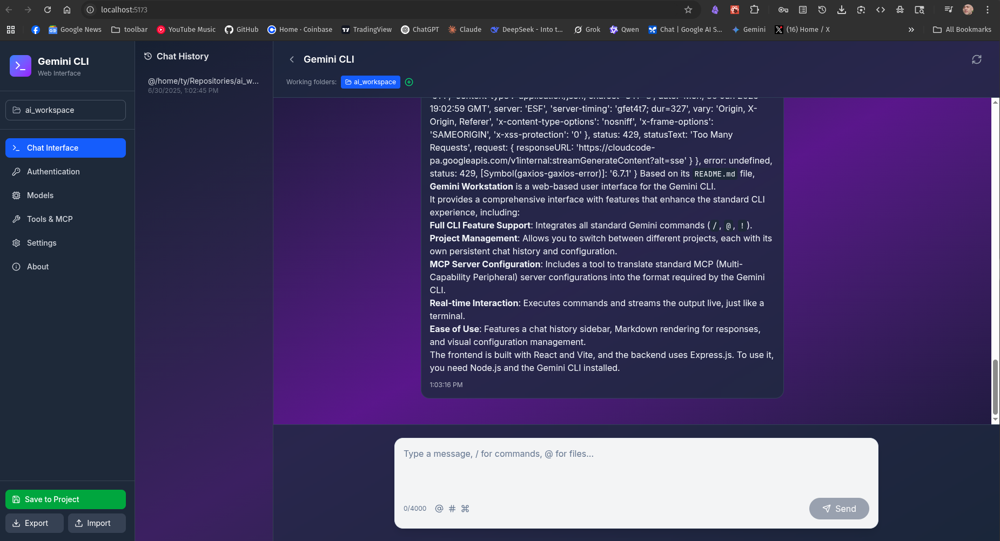

# Gemini Workstation - Enhanced Web UI for Gemini CLI

A comprehensive web interface for Google's Gemini CLI with full feature support, including chat history, project management, MCP server configuration, and command support.

## Currently needs polish- AI Generated Code by Claude, use at own risk.



## Features

### ✨ Core Features
- **Full CLI Command Support**: Supports all Gemini CLI commands (/, @, !)
- **Chat History Sidebar**: Persistent chat history per project with easy navigation
- **Project Dropdown Selector**: Quick project switching with configuration loading
- **MCP Configuration Translation**: Import standard MCP configs and auto-translate to Gemini format
- **Real-time Command Execution**: Execute commands with live output streaming
- **Markdown Rendering**: Beautiful markdown rendering with syntax highlighting

### 🛠️ Configuration Management
- **Per-Project Settings**: Save settings and environment variables per project
- **Import/Export**: Export and import configurations as JSON files
- **Auto-Save**: Settings automatically saved to localStorage
- **Project Detection**: Auto-discovers projects with .git, package.json, or .gemini folders

### 🔧 MCP Server Support
- **Easy Configuration**: Visual interface for adding MCP servers
- **Config Translation**: Paste standard MCP configs and auto-convert to Gemini format
- **Support for UV/UVX**: Full support for UV and UVX-based MCP servers
- **Environment Variables**: Configure server-specific environment variables

## Installation

### Prerequisites
- Node.js 18+ and npm
- Gemini CLI installed globally (`npm install -g @google/gemini-cli`)
- A Gemini API key or Google Cloud Project configured

### Setup

1. **Install Dependencies**:
```bash
# Install frontend dependencies
npm install

# Install backend dependencies
cd server && npm install && cd ..
```

2. **Configure Authentication**:
   - Get a Gemini API key from [Google AI Studio](https://aistudio.google.com/app/apikey)
   - Or configure Google Cloud Project for Code Assist

3. **Start the Application**:
```bash
# Run both frontend and backend
./start.sh

# Or run separately:
# Terminal 1 - Backend
cd server && npm start

# Terminal 2 - Frontend
npm run dev
```

4. **Open in Browser**:
   - Frontend: http://localhost:5173
   - Backend API: http://localhost:3001

## Usage Guide

### 1. Project Selection
- Click the project dropdown in the sidebar
- Select from discovered projects or refresh the list
- Projects with existing Gemini configuration show a "Configured" badge

### 2. Authentication Setup
- Navigate to the Authentication tab
- Choose between API Key or Google Cloud Project
- Enter your credentials
- Save to project using the sidebar button

### 3. MCP Server Configuration
- Go to Tools & MCP tab
- Click "Import Config" to translate standard MCP configs
- Or manually add servers with the "Add Server" button
- Supported formats:
  ```json
  {
    "sqlite": {
      "command": "uv",
      "args": ["--directory", "/path/to/server", "run", "mcp-server-sqlite"]
    }
  }
  ```

### 4. Using the Chat Interface

#### Command Support
- **Slash Commands** (`/`): Type `/` to see available commands
  - `/help` - Display help
  - `/tools` - List available tools
  - `/mcp` - Show MCP servers
  - `/memory` - Manage context
  - `/stats` - Show statistics
  - `/clear` - Clear screen

- **File Inclusion** (`@`): Include file or directory content
  - `@src/app.js` - Include single file
  - `@src/` - Include directory
  - Respects .gitignore by default

- **Shell Commands** (`!`): Execute shell commands
  - `!ls -la` - List files
  - `!git status` - Check git status
  - `!` alone toggles shell mode

#### Chat Features
- **History Navigation**: Use Up/Down arrows to navigate previous messages
- **Markdown Support**: Responses rendered with syntax highlighting
- **Auto-scroll**: Automatically scrolls to latest message
- **Persistent History**: Chat history saved per project

### 5. Configuration Management
- **Save to Project**: Saves `.gemini/settings.json` and `.env` to current project
- **Export Config**: Download configuration as JSON
- **Import Config**: Load configuration from JSON file
- **Auto-save**: Settings automatically saved to browser localStorage

## Configuration Files

### Project Structure
```
your-project/
├── .gemini/
│   └── settings.json    # Gemini CLI settings
├── .env                 # Environment variables
└── GEMINI.md           # Context file (optional)
```

### Settings Example
```json
{
  "theme": "Default",
  "contextFileName": "GEMINI.md",
  "autoAccept": false,
  "sandbox": false,
  "mcpServers": {
    "myServer": {
      "command": "python",
      "args": ["server.py"],
      "cwd": "./mcp_servers",
      "timeout": 600000,
      "trust": false
    }
  }
}
```

## Troubleshooting

### Backend Connection Issues
- Ensure the backend is running on port 3001
- Check for any firewall blocking localhost connections
- Verify no other service is using port 3001

### Gemini CLI Not Found
- Ensure Gemini CLI is installed globally
- Check PATH includes npm global binaries
- Try running `gemini` directly in terminal

### Authentication Errors
- Verify your API key is correct
- Check Google Cloud Project permissions
- Ensure environment variables are properly set

## Development

### Tech Stack
- **Frontend**: React, Vite, Tailwind CSS, Lucide Icons
- **Backend**: Express.js, WebSocket, node-pty
- **Features**: Real-time PTY sessions, configuration management, chat history

### API Endpoints
- `GET /api/projects` - List available projects
- `POST /api/config/save` - Save project configuration
- `GET /api/config/load` - Load project configuration
- `POST /api/mcp/translate` - Translate MCP configuration
- `POST /api/cli/execute` - Execute CLI command
- `WebSocket /` - Real-time CLI output

## License

This project is a web interface for Google's Gemini CLI. Please refer to the Gemini CLI license and terms of service.
